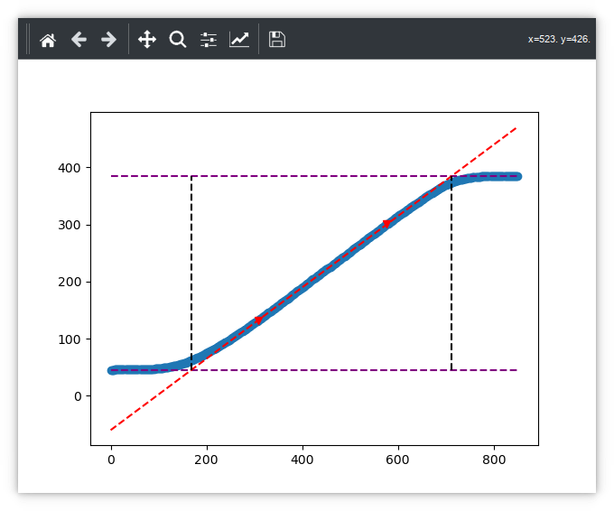

# PID Tuning Using Ziegler-Nicols

This uses the Ziegler Nicols method to estimate values for the Kp/Ki/Kd PID control values.

The method implemented here is taken from ["Ziegler–Nichols Tuning Method"](https://www.ias.ac.in/article/fulltext/reso/025/10/1385-1397) by Vishakha Vijay Patel

One issue with Ziegler Nicols is that is a **heuristic**: it generally works quite well, but it might not be the optimal values. Further manual adjustment may be necessary.

## Process Overview

1. First of all, you will record a temperature profile for your kiln.
2. Next, we use those figures to estimate Kp/Ki/Kd.

## Step 1: Record Temperature Profie

Ensure `kiln-controller` is **stopped** during profile recording: The profile must be recorded without any interference from the actual PID control loop (you also don't want two things changing the same GPIOs at the same time!)

Make sure your kiln is completely cool - we need to record the data starting from room temperature to correctly measure the effect of kiln/heating.

There needs to be no abnormal source of temperature change to the kiln: eg if you normally run with a kiln plug in place - makae sure its in place for the test!

To record the profile, run:
```
python kiln-tuner.py zn.csv
```

The above will drive your kiln to 400 and record the temperature profile to the file `zn.csv`. The file will look something like this:

```
time,temperature
4.025461912,45.5407078
6.035358906,45.5407078
8.045399904,45.5407078
10.05544925,45.59087846
...
```

## Step 2: Compute the PID parameters

Once you have your zn.csv profile, run the following:

```
python zieglernicols.py zn.csv
```

The values will be output to stdout, for example:
```
Kp: 3.853985144980333 1/Ki: 87.78173053095107 Kd: 325.9599328488931
```
(Note that the Ki value is already inverted ready for use in config)

------

## Sanity checking the results

If you run
```
python zieglernicols.py zn.csv --showplot
```

It will display a plot of the parameters. It should look simular to this .

Note: you will need python's `pyplot` installed for this to work.

The smooth linear part of the chart is very important. If it is too short, try increasing the target temperature (see later).

The red diagonal line: this **must** follow the smooth part of your chart closely.

## My diagonal line isn't right

You might need to adjust the line parameters to make it fit your data properly. You can do this as follows:

```
python zieglernicols.py zn.csv --tangentdivisor 8
```

`tangentdivisor` modifies which parts of the profile is used to calculate the line.

It is a floating point number >= 2; If necessary, try varying it till you get a better fit.

## Changing the target temperature

By default it is 400. You can change this as follows:

```
python kiln-tuner.py zn.csv --targettemp 500
```

(where the target temperature has been changed to 500)
